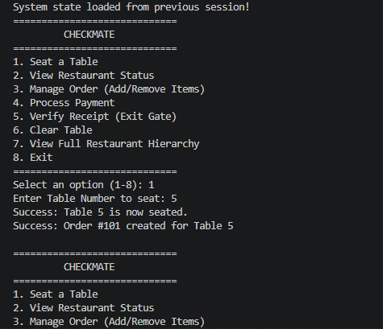

# 🛡️ CheckMate – Restaurant Order & Exit Verification System

CheckMate is a pure Java terminal application designed to combat the industry-wide issue of **dine-and-dash incidents**. By integrating order management with a single-use exit verification gate, CheckMate ensures customers can only leave the restaurant after their bill has been fully settled and verified.

---

## 🎯 Motivation & Problem Statement
Dine-and-dash incidents cost independent restaurants thousands of dollars annually and directly penalize waitstaff. While traditional Point of Sale (POS) systems focus primarily on order entry and billing, they lack an operational mechanism to verify payment completion at venue exit points. CheckMate bridges this gap by issuing unique verification receipts that are validated at security/exit check points before table clearance.

---

## ✨ Features

* **Table & Lifecycle Management**: Track real-time table statuses (`Available`, `Occupied (Ordering)`, `Awaiting Payment`, `Paid (Pending Exit)`).
* **Order & Bill Management**: Dynamically add or remove items from customer orders with automatic price calculation.
* **Exit Verification Gate**: Validates receipt authenticity and prevents double-pass reuse (receipts cannot be reused once verified at the exit).
* **Automatic File Persistence**: Automatically saves and loads restaurant state across application restarts using Java Object Serialization (`checkmate_data.ser`).
* **Robust Error Handling**: Handles invalid table IDs, double-payments, and unseated ordering gracefully without system crashes.

---

## 🏗️ Class Architecture & OOP Principles

* **Encapsulation**: Class fields are marked `private` with public getter/setter access where appropriate.
* **Abstraction**: `ConsoleUI` handles terminal input/output, separating presentation logic from domain models (`Restaurant`, `Order`, etc.).
* **Persistence**: Object state serialized to disk using `java.io.Serializable`.

---
### 🏗️ Architecture Diagram

```
+-----------------+        1..n       +-----------------+
|   Restaurant    |-------------------|      Table      |
+-----------------+                   +-----------------+
         | 1..n                                | 0..1
         |                                     |
+-----------------+                   +-----------------+
|     Receipt     |                   |      Order      |
+-----------------+                   +-----------------+
                                               | 1..n
                                      +-----------------+
                                      |    MenuItem     |
                                      +-----------------+
```

---

## 🛠️ Built With

* **Language**: Java 17+
* **IDE**: Visual Studio Code / Visual Studio
* **Version Control**: Git & GitHub

---

---

## 🚀 Getting Started

### Prerequisites
* Java Development Kit (JDK) 17 or higher installed and added to your system `PATH`.

### Installation & Execution

1. **Clone the repository**:
   ```bash
   git clone [https://github.com/pkyeibrewu1/Checkmate.git](https://github.com/pkyeibrewu1/Checkmate.git)
   cd Checkmate
Compile the source files:

Bash
javac *.java